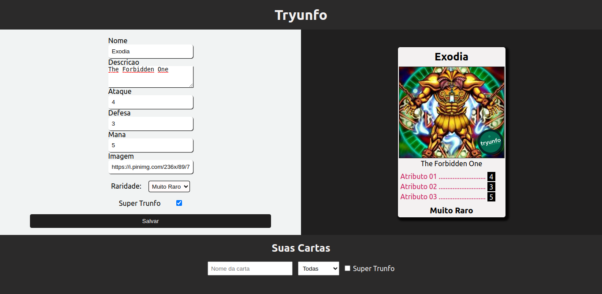
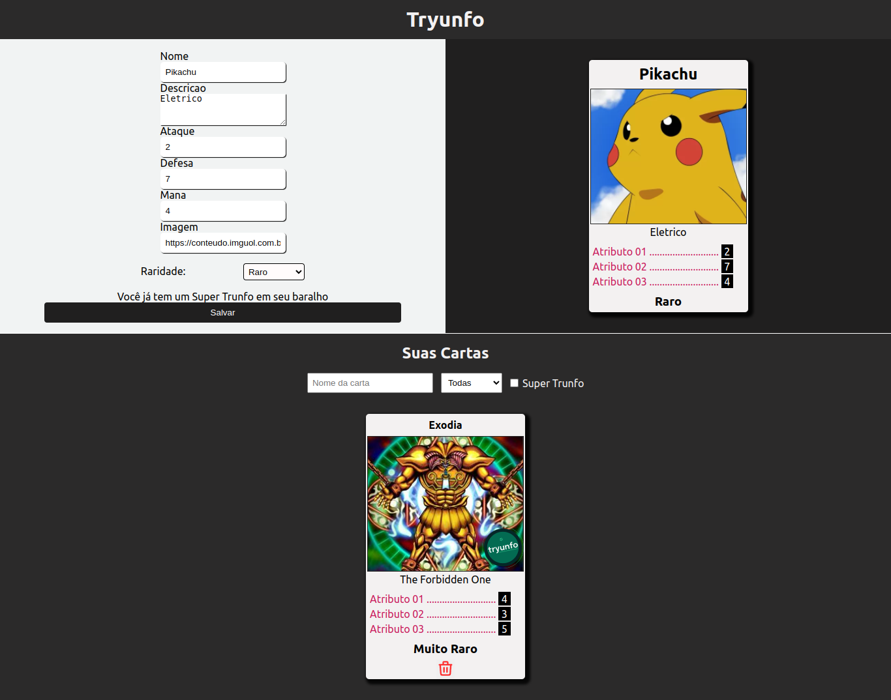

# Tryunfo Game !

The idea with this project is to create a game, where the user can create his own cards with the desired attributes and after created, be able to use these cards to battle with other cards, where the card that has the highest selected attribute wins.

In addition to this, the user can also add filters to the search of the cards created, including applying cascading filters.

 

## Home

 

## Home After Create Card 

# Technologies Used

For this project the following technologies were used:

- [JavaScript](https://developer.mozilla.org/pt-BR/docs/Web/JavaScript)
- [ReactJS](https://pt-br.reactjs.org/)
- [Docker](https://www.docker.com/)

## How to Use:

1. Clone the repository

  ~~~bash
  git clone git@github.com:JeffThierch/Tryunfo.git
  ~~~

2. In the root of the project change the .env_example file to .env

3. (Optional) - Change the environment variables.

4. In the root of project run the commands:

  ~~~bash
  docker-compose up --build
  ~~~

5. If everything is configured correctly, after the build process you can simply access the application.
